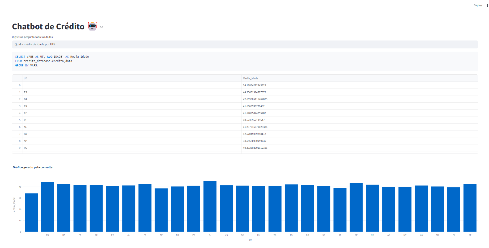
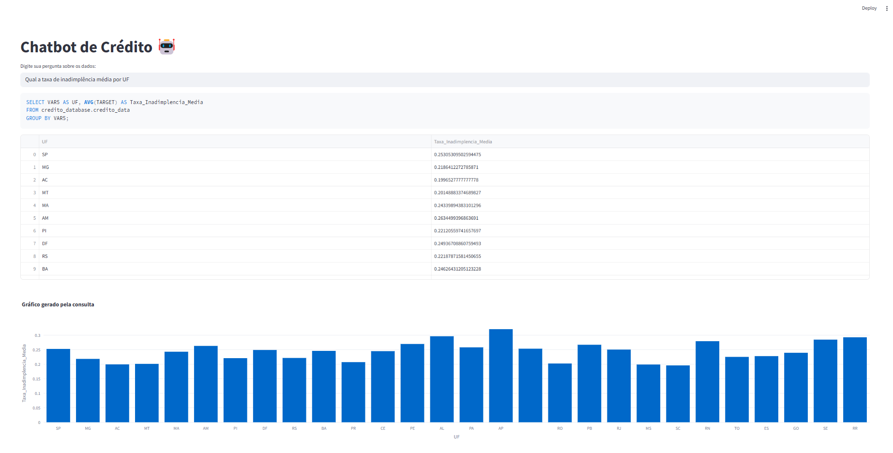
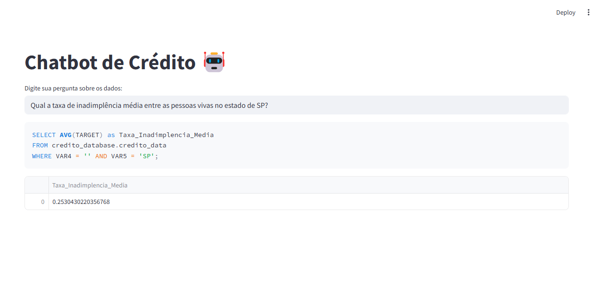
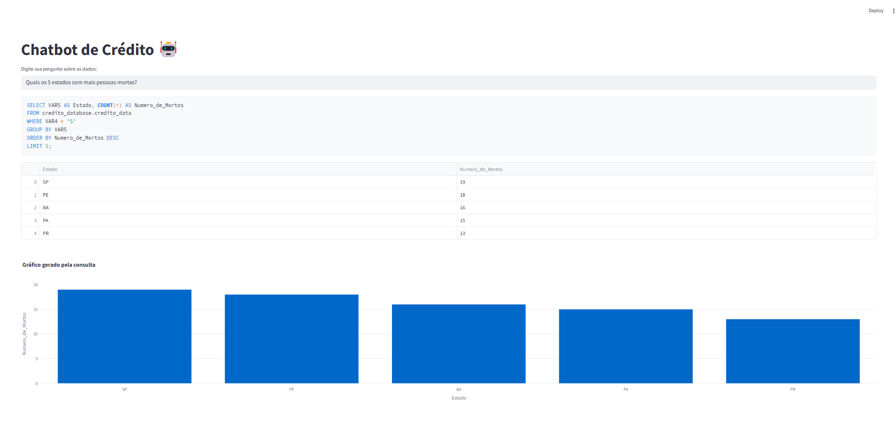

# 💬 Chatbot de Análise de Crédito com LLM + AWS Athena

Este projeto foi desenvolvido como parte de um desafio técnico para uma vaga de Cientista de Dados I.  
Prazo total para execução: **4 dias**.  
Observação: eu não tinha experiência profissional prévia com AWS Athena e com construção de chatbots com LLMs conectados a banco de dados — precisei estudar e aplicar vários conceitos aprendidos durante a pós graduação durante o desenvolvimento do projeto.

---

## Descrição

Este é um chatbot de análise de crédito, que permite que usuários façam perguntas em linguagem natural sobre um dataset de crédito hospedado na AWS S3.  
As consultas SQL são geradas dinamicamente utilizando a API da OpenAI (GPT-4), executadas no AWS Athena, e os resultados são exibidos em uma interface interativa construída com Streamlit.

---

## Stack utilizada

- **AWS S3** → armazenamento do dataset
- **AWS Athena** → mecanismo de consulta SQL
- **OpenAI GPT-4** → geração das queries SQL a partir de perguntas em linguagem natural
- **Streamlit** → interface do chatbot
- **Plotly** → visualização de dados
- **Python** → linguagem de programação
- **dotenv + boto3 + pandas** → integração e manipulação de dados

---

## Estrutura do projeto

chat_bot_llm/

├── app.py # Aplicação Streamlit

├── llm_utils.py # Funções para interação com LLM (GPT-4)

├── db_utils.py # Funções para interação com o AWS Athena

├── viz_utils.py # Funções para geração de gráficos

├── requirements.txt # Dependências

└── .env # Variáveis de ambiente (não incluso no repositório público)

---

## Tratamento de dados

Antes de subir os dados para o AWS S3:

- O dataset original apresentava aproximadamente **10% de valores ausentes na coluna `IDADE`**.
- Foi realizado um tratamento local preenchendo as idades faltantes com a mediana da idade geral.
- Após o tratamento, o dataset foi salvo e enviado para um bucket no **AWS S3**.
- No Athena, foi criada a tabela `credito_data` no banco `credito_database`, apontando para o arquivo no S3.

---

## Como rodar localmente

1. Clonar o repositório:

```bash
git clone https://github.com/seu-usuario/chat_bot_llm.git
cd chat_bot_llm
```

2. Criar um ambiente virtual (opcional, mas recomendado):

```bash
python -m venv venv
venv\Scripts\activate  # Windows
# ou
source venv/bin/activate  # Mac/Linux
```

3. Instalar as dependências:
```bash
pip install -r requirements.txt
```

4. Criar um arquivo .env com as seguintes variáveis:
```bash
OPENAI_API_KEY=sk-xxxxxxx
AWS_ACCESS_KEY_ID=xxxxxxx
AWS_SECRET_ACCESS_KEY=xxxxxxx
ATHENA_OUTPUT_LOCATION=s3://seu-bucket/query-results/
```

5. Rodar o aplicativo:
```bash
streamlit run app.py
```

---

## Exemplos de perguntas testadas
Abaixo estão 4 exemplos de perguntas testadas no chatbot, com sucesso:

1. Qual a média de idade por UF?
Query gerada:

```sql
SELECT VAR5 AS UF, AVG(IDADE) AS Media_Idade
FROM credito_database.credito_data
GROUP BY VAR5;
```


2. Qual a taxa de inadimplência média por UF?

```sql
SELECT VAR5 AS UF, AVG(TARGET) AS Taxa_Inadimplencia_Media
FROM credito_database.credito_data
GROUP BY VAR5;
```


3. Qual a taxa de inadimplência média entre as pessoas vivas no estado de SP?
```sql
SELECT AVG(TARGET) as Taxa_Inadimplencia_Media
FROM credito_database.credito_data
WHERE VAR4 = '' AND VAR5 = 'SP';
```


4. Quais os 5 estados com mais pessoas mortas?
```sql
SELECT VAR5 AS Estado, COUNT(*) AS Numero_de_Mortos
FROM credito_database.credito_data
WHERE VAR4 = 'S'
GROUP BY VAR5
ORDER BY Numero_de_Mortos DESC
LIMIT 5;
```


---

## Roadmap / Melhorias Futuras
Apesar do curto prazo de 4 dias para execução (tendo sido necessário também um período de estudo sobre a integração com AWS Athena e Streamlit), algumas oportunidades de evolução já foram mapeadas para uma futura versão deste projeto, ficando em backlog:

1. Refinamento de prompt para geração de queries
- Incluir no prompt da função gerar_query_sql uma orientação explícita para que as queries retornem os resultados ordenados do maior para o menor valor, exceto quando o usuário solicitar outra ordenação.
- Adicionar instruções para que o LLM reconheça automaticamente possíveis filtros implícitos mencionados na linguagem natural (ex.: "pessoas vivas", "dados recentes", etc.).

2. Geração de respostas mais naturais
- Após obter os resultados no DataFrame, implementar uma etapa adicional de envio desse resultado para o LLM.
- Solicitar que o LLM formule uma resposta em linguagem natural e amigável, tornando a interação mais próxima de uma conversa com um analista de dados humano.

3. Visualizações dinâmicas e personalizadas
- Permitir que o LLM sugira o tipo de gráfico mais apropriado com base na pergunta do usuário e nos dados retornados (ex.: barras, linhas, pizza, heatmaps).
- Tornar a camada de visualização mais flexível, aceitando parâmetros dinâmicos.

4. Extensibilidade do código
- Adicionar suporte a filtros temporais nas perguntas (ainda não está 100%)
- Implementar suporte a exportação dos resultados em CSV/Excel diretamente pela interface do Streamlit.


---

## Observações finais

O projeto foi entregue dentro do prazo proposto (4 dias).

Durante o desenvolvimento, aprofundei meu conhecimento em: AWS S3 e Athena; OpenAI API para geração de queries SQL; Integração entre LLM + banco de dados.

Construção de uma interface interativa com Streamlit

Dataset foi tratado para garantir a integridade das análises.

Um vídeo de demonstração do funcionamento está disponível no link a seguir:
https://youtu.be/M-GvCSXKyXg

Obrigado pela oportunidade!
Caso tenha qualquer dúvida ou sugestão de melhoria, fico à disposição. 
